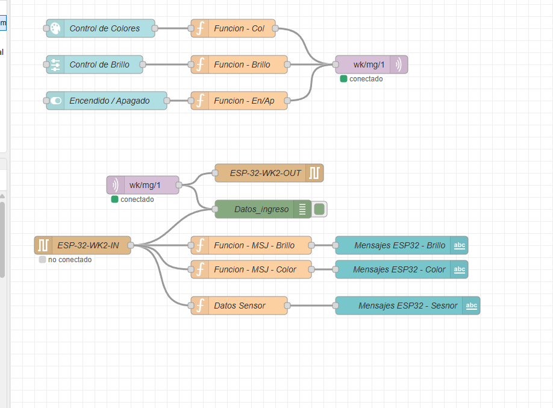

# Welcome Kit Galileo: ESP32, BME680 y Node-RED

Proyecto desarrollado utilizando el **Welcome Kit de Universidad Galileo**.

El sistema permite controlar tres NeoPixel desde un Dashboard de Node-RED. Es posible encenderlos, apagarlos, cambiar su color y controlar su brillo.

También permite recibir información de un sensor BME680 para visualizar temperatura, humedad y resistencia de gases.

La comunicación entre computadoras se realiza mediante MQTT, mientras que la ESP32 se comunica localmente con Node-RED por medio del puerto USB/Serial.

---

# Características

- Control de tres NeoPixel.
- Encendido y apagado desde Node-RED.
- Selección visual de colores.
- Control de brillo entre 0 y 255.
- Lectura de temperatura.
- Lectura de humedad.
- Lectura de resistencia de gases.
- Comunicación MQTT entre computadoras.
- Comunicación serial entre Node-RED y ESP32.
- Dashboard accesible desde una computadora o teléfono.

---

# Instalación

## 1. Instalar Node.js

Ingresa a la página oficial:

[Descargar Node.js](https://nodejs.org/en/download)

1. Descarga la versión **LTS** para Windows.
2. Ejecuta el instalador.
3. Mantén las opciones predeterminadas.
4. Al finalizar, abre CMD.

Comprueba la instalación ejecutando:

```bash
node --version
npm --version
```

Debe aparecer un resultado similar a:

```text
v18.15.0
9.5.0
```

Los números pueden cambiar dependiendo de la versión instalada.

---

## 2. Instalar Node-RED

Abre CMD y ejecuta:

```bash
npm install -g node-red
```

Después de finalizar la instalación, inicia Node-RED con:

```bash
node-red
```

Abre en el navegador:

```text
http://localhost:1880
```

Para acceder al Dashboard utiliza:

```text
http://localhost:1880/ui
```

> La ventana de CMD debe permanecer abierta mientras Node-RED esté funcionando.

---

## 3. Instalar los nodos adicionales

Dentro de Node-RED:

1. Abre el menú principal.
2. Selecciona **Manage palette**.
3. Ingresa a la pestaña **Install**.
4. Instala los siguientes paquetes:

```text
node-red-dashboard
node-red-node-serialport
```

Estos paquetes permiten utilizar el Dashboard y la comunicación serial con la ESP32.

---

## 4. Instalar Arduino IDE

Descarga Arduino IDE desde:

[Descargar Arduino IDE](https://www.arduino.cc/en/software)

Ejecuta el instalador y mantén las opciones recomendadas.

---

## 5. Instalar la tarjeta ESP32

En Arduino IDE:

1. Abre **File → Preferences**.
2. Busca **Additional Boards Manager URLs**.
3. Agrega la siguiente dirección:

```text
https://espressif.github.io/arduino-esp32/package_esp32_index.json
```

4. Presiona **OK**.
5. Abre **Tools → Board → Boards Manager**.
6. Busca `esp32`.
7. Instala **esp32 by Espressif Systems**.

Si el proyecto requiere la versión `2.0.17`, selecciónala antes de instalar.

Después selecciona:

```text
Tools → Board → ESP32 Arduino → ESP32 Dev Module
```

---

## 6. Instalar las bibliotecas

Abre el Administrador de bibliotecas de Arduino IDE e instala:

| Biblioteca | Función |
|:---|:---|
| Adafruit BME680 Library | Lectura del sensor BME680 |
| Adafruit Unified Sensor | Dependencia para sensores Adafruit |
| Adafruit NeoPixel | Control de los NeoPixel |

---

## 7. Programación de la ESP32

La programación completa de Arduino se encuentra disponible en el siguiente archivo:

[Ver programación de la ESP32](ProgramacionWelcomeKit2026/ProgramacionWelcomeKit2026.ino)

Para cargar la programación:

1. Conecta la ESP32 a la computadora mediante un cable USB.
2. Descarga o abre el archivo `ProgramacionWelcomeKit2026.ino`.
3. Abre el archivo utilizando Arduino IDE.
4. Selecciona la placa ESP32 correspondiente.
5. Selecciona el puerto COM de la ESP32.
6. Presiona el botón **Upload**.
7. Espera hasta que Arduino IDE confirme que la carga terminó.
8. Cierra el Monitor Serial.
9. Inicia Node-RED.

> Node-RED y el Monitor Serial de Arduino IDE no pueden utilizar simultáneamente el mismo puerto COM.

---

# Flujo de Node-RED

El flujo de Node-RED está dividido en dos partes principales: envío de comandos y recepción de información.

## Envío de comandos

La primera parte contiene los controles del Dashboard:

```text
Control de colores → Function Color
Control de brillo → Function Brillo
Encendido/Apagado → Function Encendido/Apagado
```

Las tres funciones se conectan al nodo MQTT Out que utiliza el siguiente topic:

```text
wk/mg/1
```

## Recepción de comandos

La segunda parte recibe los mensajes MQTT y los envía a la ESP32 mediante el puerto serial:

```text
MQTT In → Serial Out → ESP32
```

Las respuestas y mediciones de la ESP32 se reciben mediante el nodo Serial In:

```text
ESP32 → Serial In ─┬→ Function Mensaje Brillo
                   ├→ Function Mensaje Color
                   └→ Function Datos Sensor
```

## Imagen del flujo

La siguiente imagen muestra el flujo completo desarrollado en Node-RED:



---

# Archivos del proyecto

```text
Welcome-Kit-Galileo-ESP32-NodeRED/
├── README.md
├── Images/
│   └── flujo-node-red.png
└── ProgramacionWelcomeKit2026/
    └── ProgramacionWelcomeKit2026.ino
```

| Archivo | Descripción |
|:---|:---|
| [`README.md`](README.md) | Documentación e instrucciones del proyecto |
| [`ProgramacionWelcomeKit2026.ino`](ProgramacionWelcomeKit2026/ProgramacionWelcomeKit2026.ino) | Programación completa de la ESP32 |
| [`flujo-node-red.png`](Images/flujo-node-red.png) | Imagen del flujo desarrollado en Node-RED |

---

# Repositorio

El proyecto completo se encuentra disponible en:

[Welcome-Kit-Galileo-ESP32-NodeRED](https://github.com/LinkPowerLoang/Welcome-Kit-Galileo-ESP32-NodeRED)

---

# Créditos

## Autor

**Mateo García**

- GitHub: [LinkPowerLoang](https://github.com/LinkPowerLoang)
- Estudiante de la carrera de Ingeniería.
- Seleccionado nacional de Robótica en 2020 y 2021.
- Actualmente, coach de la Selección Nacional de Robótica.

Proyecto desarrollado utilizando el **Welcome Kit de Universidad Galileo**.
